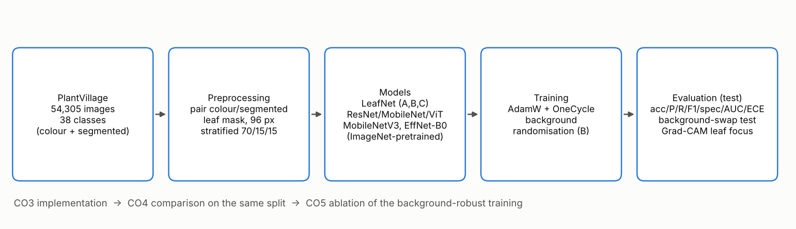
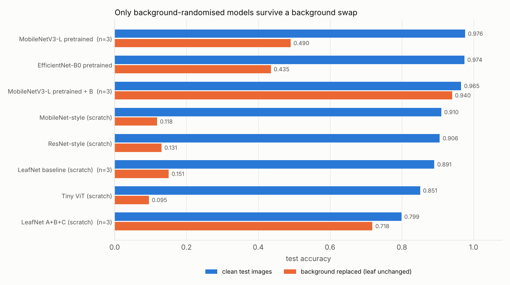

# MUJ-DS-2430010316

## Student details
- Name: Garv
- Registration number: 2430010316
- Branch: CSE (Data Science)
- GitHub username: garvbhardwaj1607-cell
- Training programme: DSE3120 - Deep Learning
- Instructor: Dr. Sandeep Gupta

## Project title
**Explainable and Background-Robust Plant Disease Classification on PlantVillage** (Deep Learning project and capstone)

## What this project does
PlantVillage leaf photographs share a uniform background, so a classifier can partly rely on it. This project trains and compares from-scratch and ImageNet-pretrained CNNs on the real PlantVillage dataset, shows how much they depend on the background with a background-swap test, and fixes most of that dependence by training with random background replacement.

## Results at a glance
1. **Implementation (CO3):** real PlantVillage data (54,305 images, 38 classes; a stratified 7,552-image subset at 96x96 was used for the CPU experiments), 5 from-scratch and 3 ImageNet-pretrained model variants, full metric suite, confusion matrices, curves.
2. **Comparison (CO4):** 8 models on one identical split; ImageNet-pretrained models reach about 97.4-97.6 % test accuracy; the from-scratch comparison models range from about 79.9-91.0 % on the same experimental split.
3. **Innovation (CO5):** models without background randomisation lose substantial accuracy when only the leaf background is replaced. Training with random background replacement keeps the pretrained MobileNetV3-L at **0.9400 ± 0.0050** background-swap accuracy versus **0.4901 ± 0.0348** for plain fine-tuning, with clean accuracy of **0.9653 ± 0.0061** versus **0.9762 ± 0.0036** (3 seeds each).
4. **What did not help:** squeeze-and-excitation attention (A) changed accuracy by -0.5 points and background-swap accuracy by -0.8 points (within seed noise); the mask-supervised attention (C) gave +1.4 points of background-swap accuracy for -1.6 points of clean accuracy.

Full results, tables and limitations: [`capstone/README.md`](capstone/README.md).

## Repository layout
| Folder | Content |
|---|---|
| `assignments/` | Deep Learning project brief and a requirement-by-requirement checklist (CO3/CO4/CO5) |
| `notebooks/` | Google Colab notebook: pretrained models on the full dataset at 224 px |
| `code/` | All source code: preprocessing, models, training, evaluation, graphs, demo, README generator |
| `resources/` | References and dataset links |
| `presentations/` | Project presentation |
| `capstone/` | The project itself: README with results, requirements, run scripts, results, figures, demo checkpoint |
| `docs/`, `scripts/`, `.github/` | GitHub workflow, issue list and creation script, pull-request template |

## Quick start
See [`INSTALL.md`](INSTALL.md). Demo on one image: `cd capstone && python ../code/demo.py --image leaf.jpg`.

## Deliverables checklist (guidelines, step 11)
| Deliverable | Where |
|---|---|
| Source code | `code/`, `notebooks/` |
| Documentation | `capstone/README.md`, `INSTALL.md`, `docs/` |
| Presentation | `presentations/` |
| Screenshots / figures | `capstone/figures/` (Colab-run screenshots: open issue 12) |
| Results | `capstone/results/` |
| Installation guide | `INSTALL.md` |

## Status
The current experimental results are based on the completed study runs, while the project also includes a full-data 224 px Colab notebook for continued experimentation and future updates. Known limitations and follow-up experiments are documented in [`docs/ISSUES.md`](docs/ISSUES.md). GitHub steps that need an account (repository creation, instructor collaborator, issues, pull requests) are in [`docs/GITHUB_WORKFLOW.md`](docs/GITHUB_WORKFLOW.md).
