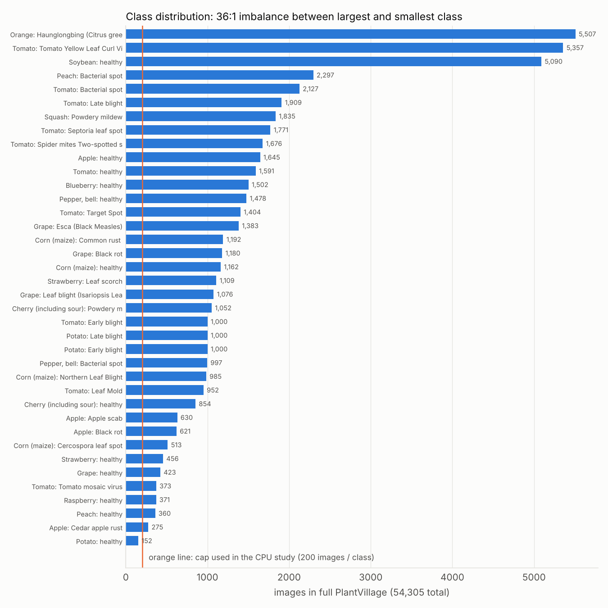
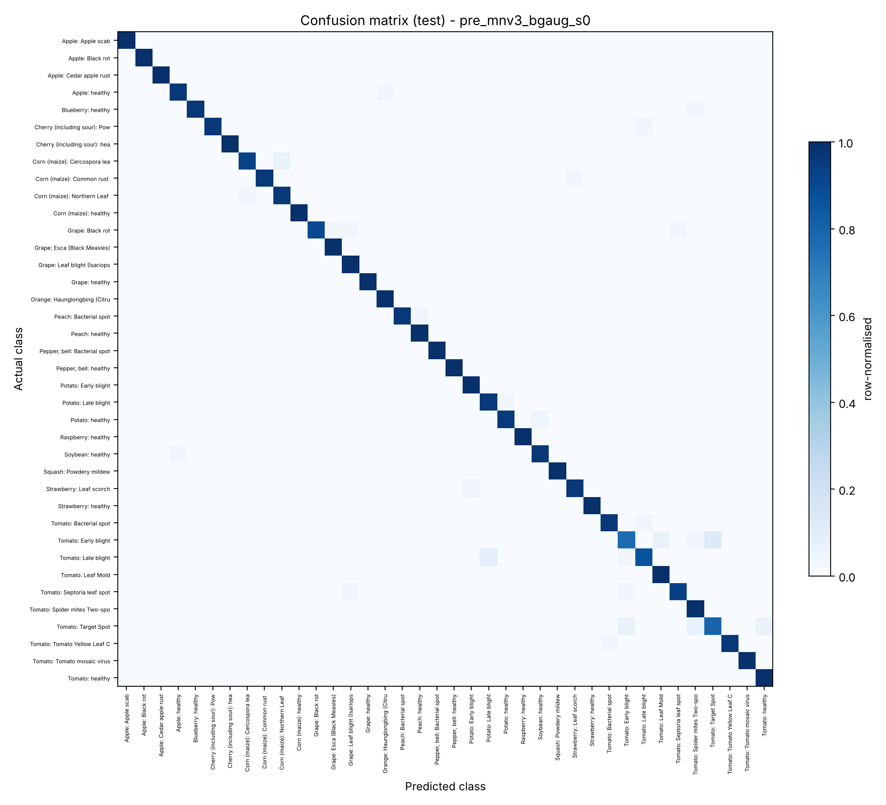
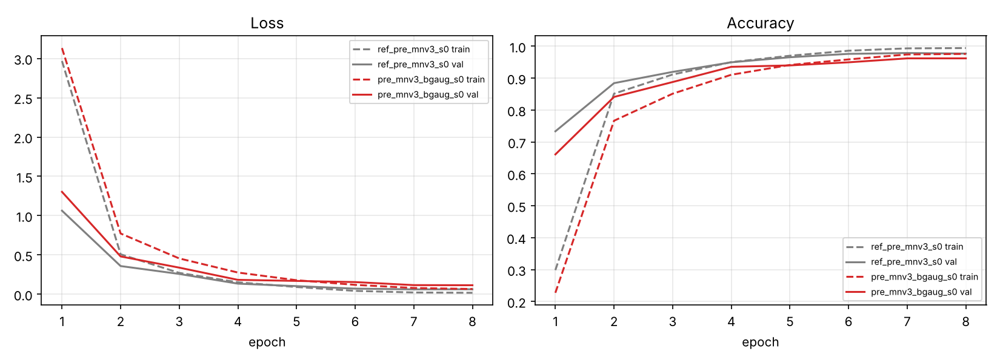
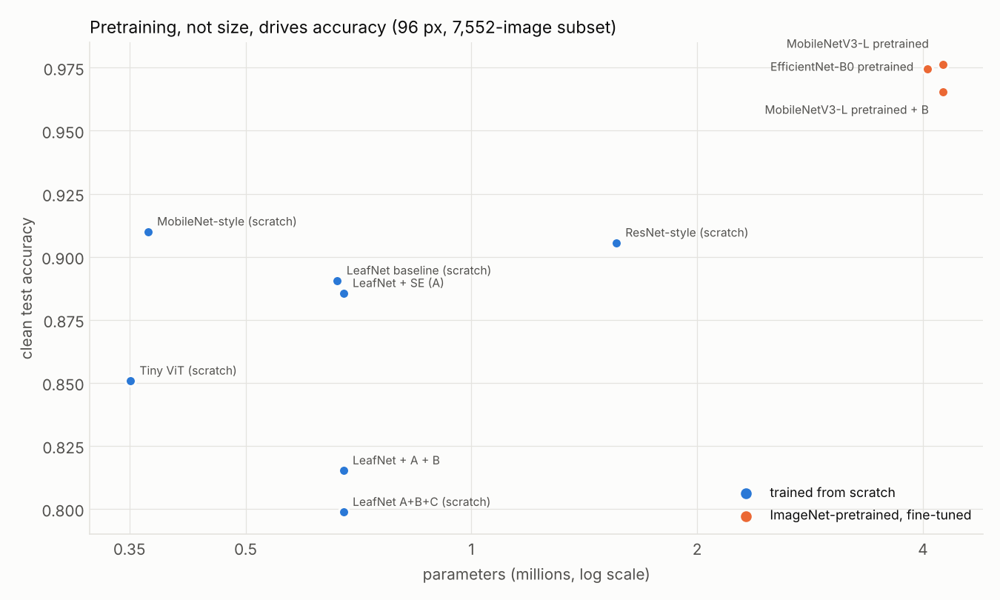
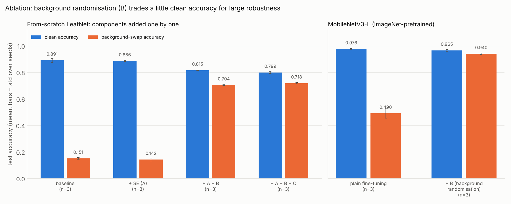
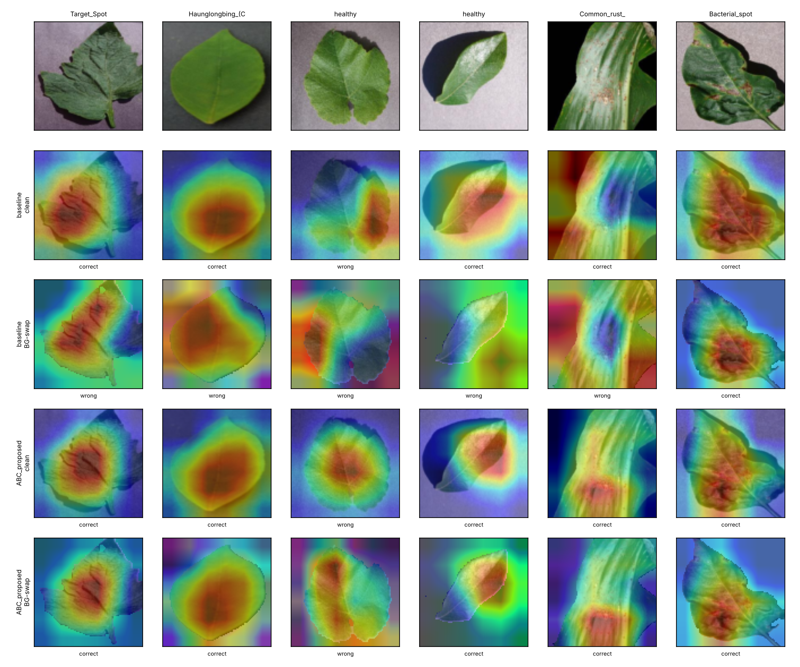
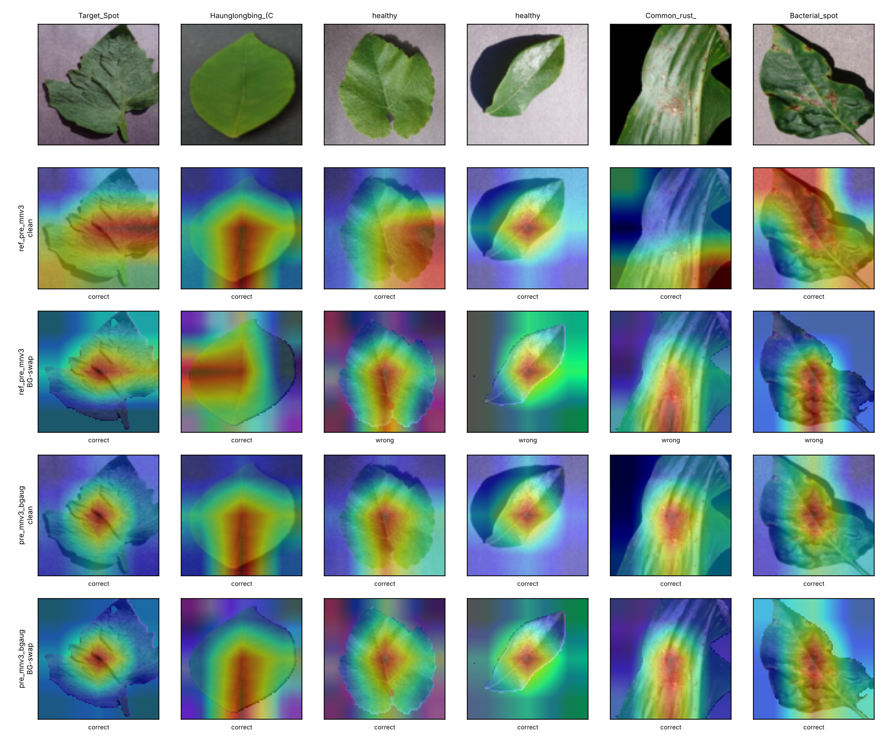

# Explainable and Background-Robust Plant Disease Classification on PlantVillage

*Deep Learning project (CO3 Apply, CO4 Comparative analysis, CO5 Innovation).*

## 1. Student details
- Name: Garv
- Registration number: 2430010316
- Branch: CSE (Data Science)
- GitHub username: garvbhardwaj1607-cell
- Training programme: DSE3120 - Deep Learning
- Instructor: Dr. Sandeep Gupta

## 2. Summary of results
All numbers are produced by the code in `../code/` and stored in `results/`; this README is generated from those files (`../code/build_readme.py`).
1. **Implementation (CO3):** real PlantVillage data (54,305 images, 38 classes; a stratified 7,552-image subset at 96x96 was used for the CPU experiments), 5 from-scratch and 3 ImageNet-pretrained model variants, full metric suite, confusion matrices, curves.
2. **Comparison (CO4):** 8 models on one identical split; ImageNet-pretrained models reach about 97.4-97.6 % test accuracy; the from-scratch comparison models range from about 79.9-91.0 % on the same experimental split.
3. **Innovation (CO5):** models without background randomisation fall to 10-15 % (scratch) and 44-49 % (pretrained) accuracy when only the leaf background is replaced. Training with random background replacement keeps the pretrained MobileNetV3-L at **0.9400 ± 0.0050** background-swap accuracy (plain fine-tuning: 0.4901 ± 0.0348) for a clean-accuracy cost of 1.1 points (0.9653 ± 0.0061 vs 0.9762 ± 0.0036; 3 seeds each).
4. **What did not help:** squeeze-and-excitation attention (A) changed accuracy by -0.5 points and background-swap accuracy by -0.8 points (within seed noise); the mask-supervised attention (C) gave +1.4 points of background-swap accuracy for -1.6 points of clean accuracy.


**Status:** the current experimental study is complete, and the repository includes a full-data 224 px Colab notebook for continued experimentation and future updates.

## 3. Dataset
- **Name:** PlantVillage (colour + segmented leaf images), 38 classes (14 crops; healthy and diseased).
- **Source:** https://github.com/spMohanty/PlantVillage-Dataset (commit `7f7ecc7e1eaca78107e3affe7cb5abd9427e139a`, folders `raw/color` and `raw/segmented`). Original paper: Hughes & Salathé, arXiv:1511.08060.
- **Full dataset:** 54,305 colour images. **Used here:** a stratified subset of **7,552** images (cap of 200 per class; smaller classes keep all images, e.g. Potato healthy has 152), about 13.9 % of the data, so that all 28 training runs fit on a 2-core CPU.
- **Split (stratified, seed 42):**

| split | images | percent |
|---|---|---|
| train | 5286 | 70.0 |
| val | 1133 | 15.0 |
| test | 1133 | 15.0 |

- **Class distribution and imbalance:** the full dataset ranges from 152 to 5507 images per class (imbalance 36.2:1). The capped subset is almost balanced (140/30/30 per class for train/val/test, Potato healthy 106/23/23). Per-class counts: `results/dataset_distribution.csv`.



- **Preprocessing:** resize to 96x96 (bilinear); scale to [0,1]; per-channel mean/std normalisation, with statistics computed on the training split and used for every model (including the pretrained ones in this repo; the Colab notebook instead uses timm's ImageNet statistics); leaf mask from the segmented image (max RGB > 20, 7x7 morphological closing). Training augmentation: random flip, random 90-degree rotation, brightness x[0.8, 1.2]. Masks are used only for training (components B/C) and for the robustness/explanation metrics; **the classifier never receives a mask at inference**.
- Colour images without a segmented partner: none.

## 4. Models
- **Baseline LeafNet** (from scratch, 662,558 parameters): stem conv, three stages of two 3x3 conv-BN-ReLU layers, global average pooling, dropout 0.3, linear head.
- **LeafNet A+B+C** (675,129 parameters): baseline plus **A** squeeze-and-excitation channel attention, **B** background randomisation (with probability 0.5 the background of a training image is replaced by a random solid colour, smooth noise texture or two-colour gradient), **C** a spatial attention gate supervised with a leaf-coverage target from the mask (BCE, weight 0.5).
- **Reference models (CO4), identical split:** from scratch (same 12-epoch budget): ResNet-style, MobileNet-style, Tiny ViT; **ImageNet-pretrained and fine-tuned end to end:** MobileNetV3-Large (Howard et al., 2019) and EfficientNet-B0 (Tan & Le, 2019), `timm` implementations with the official `timm` release weights (SHA-256 prefix matches the hash in each file name).
- **Proposed model:** the pretrained MobileNetV3-Large trained with background randomisation (B). Everything else is identical to the plain fine-tuned model.
- Checkpoints are selected on **validation** accuracy; the test split is used once per model.

## 5. Hyperparameters
| Hyperparameter | From-scratch models | Pretrained models |
|---|---|---|
| Learning rate (peak) | 3e-3 | 1e-3 |
| Batch size | 64 | 64 |
| Epochs | 12 | 8 |
| Optimizer | AdamW | AdamW |
| Loss | cross-entropy (+0.5 x mask BCE for C) | cross-entropy |
| Scheduler | OneCycleLR | OneCycleLR |
| Dropout | 0.3 | timm default (none added) |
| Weight decay | 1e-4 | 1e-4 |
| Seeds | 0,1,2 for the 4 LeafNet ablation variants; 0 for the other scratch models | 0,1,2 for MobileNetV3-L (plain and +B); 0 for EfficientNet-B0 |
| Input size | 96x96 | 96x96 (not upsampled) |

## 6. Hyperparameter tuning
A small post-hoc learning-rate check was run (LeafNet baseline, seed 0, 12 epochs). The values were not used to pick the final setting; 3e-3 was fixed in advance.

| run | learning_rate | best_val_acc | train_seconds |
|---|---|---|---|
| baseline_s0 | 0.003 | 0.8923 | 536 |
| baseline_s0_lr1e-3 | 0.001 | 0.8959 | 252 |
| baseline_s0_lr6e-3 | 0.006 | 0.8923 | 278 |

Validation accuracy differs by at most 0.4 points over a 6x range of learning rate, smaller than the seed-to-seed spread of the baseline, so no real sensitivity was detected. Batch size, epochs, weight decay, dropout and the pretrained models' learning rate (1e-3, a conventional fine-tuning value) were **not** tuned; a search is an open issue.

## 7. Results (CO3), held-out test split (1133 images; mean ± std over seeds where `seeds` > 1)
| Model | seeds | Accuracy | Precision (macro) | Recall (macro) | F1 (macro) | Specificity (macro) | ROC-AUC (macro OvR) | ECE |
|---|---|---|---|---|---|---|---|---|
| **Proposed: MobileNetV3-L (pretrained) + background randomisation** | 3 | 0.9653 ± 0.0061 | 0.9657 ± 0.0058 | 0.9654 ± 0.0060 | 0.9647 ± 0.0063 | 0.9991 ± 0.0002 | 0.99954 ± 0.00002 | 0.0132 ± 0.0025 |
| MobileNetV3-L (pretrained, plain) | 3 | 0.9762 ± 0.0036 | 0.9765 ± 0.0036 | 0.9762 ± 0.0036 | 0.9760 ± 0.0036 | 0.9994 ± 0.0001 | 0.99976 ± 0.00003 | 0.0092 ± 0.0018 |
| EfficientNet-B0 (pretrained, plain) | 1 | 0.9744 | 0.9746 | 0.9746 | 0.9742 | 0.9993 | 0.99978 | 0.0126 |
| LeafNet A+B+C (scratch, lightweight variant) | 3 | 0.7988 ± 0.0059 | 0.7994 ± 0.0059 | 0.7986 ± 0.0058 | 0.7939 ± 0.0069 | 0.9946 ± 0.0002 | 0.99278 ± 0.00044 | 0.0967 ± 0.0045 |
| LeafNet baseline (scratch) | 3 | 0.8906 ± 0.0148 | 0.8928 ± 0.0154 | 0.8902 ± 0.0150 | 0.8884 ± 0.0147 | 0.9970 ± 0.0004 | 0.99727 ± 0.00045 | 0.0590 ± 0.0030 |

- Confusion matrices: `figures/confusion_<run>.png` (CSV `results/cm_<run>.csv`); the proposed model's is `figures/confusion_pre_mnv3_bgaug_s0.png`.
- Per-class precision/recall/F1/specificity: `results/perclass_<run>.csv`. All per-run metrics: `results/results.csv`.
- Training and validation curves: `figures/training_curve.png` (scratch), `figures/training_curve_pretrained.png` (pretrained), `figures/learning_curves_ablation.png`; data in `results/history_<run>.csv`.
- Weakest classes of the proposed model (seed 0, by F1):
  - Tomato___Early_blight: F1 0.807 (precision 0.852, recall 0.767)
  - Tomato___Target_Spot: F1 0.828 (precision 0.857, recall 0.800)
  - Tomato___Late_blight: F1 0.897 (precision 0.929, recall 0.867)
  - Potato___Late_blight: F1 0.935 (precision 0.906, recall 0.967)
  - Tomato___Spider_mites Two-spotted_spider_mite: F1 0.938 (precision 0.882, recall 1.000)




## 8. Comparison with other models (CO4)
Same dataset, same split, same preprocessing. "BG-swap Acc" is accuracy when the background of every test image is replaced (leaf pixels unchanged).

| Model | seeds | Accuracy | Precision(macro) | Recall(macro) | F1(macro) | AUC(macro OvR) | BG-swap Acc | Params | CPU ms/img (1 thread) |
|---|---|---|---|---|---|---|---|---|---|
| ResNet-style (scratch) | 1 | 0.9056 | 0.9089 | 0.9056 | 0.9041 | 0.99779 | 0.1306 | 1559678 | 4.69 |
| MobileNet-style (scratch) | 1 | 0.9100 | 0.9139 | 0.9100 | 0.9092 | 0.99799 | 0.1183 | 370382 | 2.49 |
| Tiny ViT (scratch) | 1 | 0.8508 | 0.8552 | 0.8510 | 0.8505 | 0.99386 | 0.0953 | 350918 | 1.40 |
| MobileNetV3-L (ImageNet-pretrained, fine-tuned) | 3 | 0.9762 ± 0.0036 | 0.9765 ± 0.0036 | 0.9762 ± 0.0036 | 0.9760 ± 0.0036 | 0.99976 ± 0.00003 | 0.4901 ± 0.0348 | 4250710 | 12.29 ± 4.22 |
| EfficientNet-B0 (ImageNet-pretrained, fine-tuned) | 1 | 0.9744 | 0.9746 | 0.9746 | 0.9742 | 0.99978 | 0.4351 | 4056226 | 9.18 |
| Baseline LeafNet | 3 | 0.8906 ± 0.0148 | 0.8928 ± 0.0154 | 0.8902 ± 0.0150 | 0.8884 ± 0.0147 | 0.99727 ± 0.00045 | 0.1506 ± 0.0069 | 662558 | 1.78 ± 0.04 |
| + mask-supervised spatial attention (A+B+C) = LeafNet A+B+C | 3 | 0.7988 ± 0.0059 | 0.7994 ± 0.0059 | 0.7986 ± 0.0058 | 0.7939 ± 0.0069 | 0.99278 ± 0.00044 | 0.7182 ± 0.0055 | 675129 | 2.14 ± 0.03 |
| MobileNetV3-L pretrained + background randomisation (B) = Proposed | 3 | 0.9653 ± 0.0061 | 0.9657 ± 0.0058 | 0.9654 ± 0.0060 | 0.9647 ± 0.0063 | 0.99954 ± 0.00002 | 0.9400 ± 0.0050 | 4250710 | 12.07 ± 4.50 |




**Published results, for context only (not comparable):** Mohanty et al. (2016) report about 99.35 % accuracy with a fine-tuned GoogLeNet on the full 38-class colour set with an 80/20 split. That uses about 7x more images, a larger input size and a different split protocol, so it must not be compared directly with the table above; it was not reproduced here.

**Reading the table.** Pretrained models are clearly best on clean accuracy, at 4.1-4.3 M parameters. Among from-scratch models the lightweight MobileNet-style network is best. Single-seed rows should not be ranked by differences of about 1 point: the LeafNet baseline alone varies by 3.6 points across 3 seeds.

## 9. Innovation and ablation (CO5)
**Innovation.** PlantVillage photographs share a uniform background, so classifiers can rely on it. The project (i) measures this with a background-swap stress test and mask-based Grad-CAM metrics built from the dataset's own segmentation, and (ii) trains with random background replacement (B), optionally with mask-supervised attention (C). SE (A), background augmentation and attention supervision are known techniques; the contribution is their combination for this setting and the quantitative evaluation of each part, including the finding that SE does not help.

**Ablation 1: from-scratch LeafNet, components added one at a time (3 seeds).**

| Experiment | A: SE | B: BG-rand | C: mask-attn | seeds | Accuracy | Macro-F1 | BG-swap Acc | BG-swap F1 | ECE |
|---|---|---|---|---|---|---|---|---|---|
| Baseline LeafNet | ✗ | ✗ | ✗ | 3 | 0.8906 ± 0.0148 | 0.8884 ± 0.0147 | 0.1506 ± 0.0069 | 0.1154 ± 0.0097 | 0.0590 ± 0.0030 |
| + SE attention (A) | ✓ | ✗ | ✗ | 3 | 0.8856 ± 0.0040 | 0.8839 ± 0.0041 | 0.1424 ± 0.0106 | 0.1046 ± 0.0081 | 0.0475 ± 0.0014 |
| + background randomisation (A+B) | ✓ | ✓ | ✗ | 3 | 0.8152 ± 0.0011 | 0.8100 ± 0.0015 | 0.7040 ± 0.0034 | 0.6985 ± 0.0041 | 0.0926 ± 0.0037 |
| + mask-supervised spatial attention (A+B+C) = LeafNet A+B+C | ✓ | ✓ | ✓ | 3 | 0.7988 ± 0.0059 | 0.7939 ± 0.0069 | 0.7182 ± 0.0055 | 0.7140 ± 0.0060 | 0.0967 ± 0.0045 |

| Experiment | Leaf-focus (clean) | Leaf-focus (BG-swap) | Deletion gain (clean) | Params |
|---|---|---|---|---|
| Baseline LeafNet | 0.5731 ± 0.0021 | 0.4899 ± 0.0164 | 0.0755 ± 0.0046 | 662558 |
| + SE attention (A) | 0.5765 ± 0.0021 | 0.5078 ± 0.0098 | 0.0910 ± 0.0066 | 675032 |
| + background randomisation (A+B) | 0.6270 ± 0.0033 | 0.6664 ± 0.0007 | 0.1438 ± 0.0023 | 675032 |
| + mask-supervised spatial attention (A+B+C) = LeafNet A+B+C | 0.6560 ± 0.0038 | 0.6722 ± 0.0029 | 0.1460 ± 0.0091 | 675129 |

**Ablation 2: ImageNet-pretrained MobileNetV3-L, with and without B (3 seeds).**

| Experiment | B: BG-rand | seeds | Accuracy | Macro-F1 | BG-swap Acc | BG-swap F1 | ECE | Leaf-focus (clean) | Leaf-focus (BG-swap) | Params |
|---|---|---|---|---|---|---|---|---|---|---|
| MobileNetV3-L pretrained (plain) | ✗ | 3 | 0.9762 ± 0.0036 | 0.9760 ± 0.0036 | 0.4901 ± 0.0348 | 0.4832 ± 0.0238 | 0.0092 ± 0.0018 | 0.5985 ± 0.0020 | 0.6375 ± 0.0144 | 4250710 |
| MobileNetV3-L pretrained + background randomisation (B) | ✓ | 3 | 0.9653 ± 0.0061 | 0.9647 ± 0.0063 | 0.9400 ± 0.0050 | 0.9395 ± 0.0052 | 0.0132 ± 0.0025 | 0.6680 ± 0.0066 | 0.6940 ± 0.0103 | 4250710 |





- *Leaf-focus*: fraction of Grad-CAM mass inside the leaf (the leaf covers about 0.48 of the image, so about that value means no preference). *Deletion gain*: how much faster the predicted-class probability drops when the most salient pixels are removed than when a random smooth map is used. Both on 400 test images.
- A (SE): -0.5 points clean, -0.8 points background-swap accuracy, i.e. no measurable benefit.
- B (background randomisation): -7.0 points clean, +56.2 points background-swap accuracy on LeafNet; on the pretrained model -1.1 points clean and +45.0 points background-swap accuracy, and background-swap leaf-focus 0.637 to 0.694.
- C (mask-supervised attention): -1.6 points clean, +1.4 points background-swap accuracy, a small trade-off.

## 10. Limitations
- **Possible optimism from the random split:** PlantVillage has several photos of the same leaf and the split is random per image, so near-duplicates may cross train/test. This is a known concern; it was not measured here (open issue).
- **The background-swap test is synthetic** and uses the same family of random backgrounds as the training augmentation, so it shows learned invariance to those backgrounds, not robustness on real field photographs (open issue).
- **Seeds:** the four LeafNet ablation variants and the MobileNetV3-L pair have 3 seeds; all other rows are single runs.
- **Calibration:** background-trained scratch models are less well calibrated (see ECE columns).
- Grad-CAM at 96 px input has a coarse feature map (6x6 for LeafNet, 3x3 for the pretrained models).

## 11. Demo
```bash
python ../code/demo.py --image path/to/leaf.jpg --ckpt models/proposed_mnv3_bgaug.pt --out demo_output.png
```
Prints the top-3 classes and saves a Grad-CAM overlay. Example: `figures/demo_example.png` - an arbitrarily chosen Tomato Late blight photo (5th file in its folder, not chosen for being correct; it may be in the training split). The model predicted Early blight (p=0.65), i.e. **a wrong prediction**, on a badly damaged leaf; it is kept as an honest example of a failure.

## 12. Status, roadmap and future commits
| Item | Status |
|---|---|
| CO3: implementation, metrics, confusion matrices, curves | done (subset, 96 px) |
| CO4: comparison on the same split | done (8 models) |
| CO5: innovation with 3-seed ablations | done |
| Full dataset, 224 px, GPU (Colab notebook) | prepared, **to run** (issue 9) |
| Near-duplicate leakage check | open (issue 10) |
| Real field images | open (issue 11) |
| Screenshots of the Colab run | open (issue 12) |
| Export the presentation to PPTX/PDF into `../presentations/` | open (issue 13) |
| Hyperparameter search, web demo, CI | open (issues 14-16) |

The issue list is in `../docs/ISSUES.md`. Each open item is a planned future commit.

## 13. Folder structure
```
capstone/
├── README.md                  # this file (generated by ../code/build_readme.py)
├── requirements.txt
├── run_all.sh                 # from-scratch experiments (resumable)
├── run_pretrained.sh          # pretrained fine-tuning (resumable)
├── data/dataset_information.txt
├── results/                   # results.csv, comparison.csv, ablation*.csv, lr_sensitivity.csv, dataset_*.csv,
│                              # metrics_*.json, perclass_*.csv, cm_*.csv, history_*.csv, train_*.json
├── figures/                   # confusion_*.png, graph_*.png, training curves, Grad-CAM figures, demo example
├── models/                    # proposed_mnv3_bgaug.pt (demo checkpoint) and model_description.txt
└── logs/                      # training / evaluation logs
../code/                       # preprocessing.py, model.py, train.py, test.py, aggregate.py, make_graphs.py, demo.py, utils.py, build_readme.py
../notebooks/                  # Colab notebook (full dataset, 224 px)
```
Installation and reproduction: `../INSTALL.md`. References: `../resources/references.md`.
